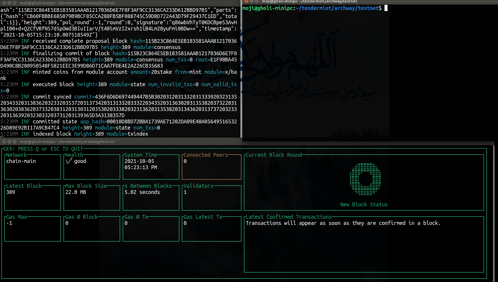

# Running a Local Testnet

To have a working network we need at least one validator node. So, let's create a validator node.

## Step 1: Initialize the validator node
Let's first crate a directory to keep all nodes data in it.

```bash
mkdir testnet
cd testnet
```
Create a directory for the main node (the first node)
```bash
mkdir -p node-main
```

Initiate the node with the chain name.

```bash
archwayd init node-main --chain-id my-chain --home ./node-main
```

Create a key to hold your account.

```bash
archwayd keys add node-main-account
```

Add that key into the genesis.app_state.accounts array in the genesis file.

**Note:** this command lets you set the number of coins. Make sure this account has some coins
with the genesis.app_state.staking.params.bond_denom denom, the default is staking.


```bash
archwayd add-genesis-account $(archwayd keys show node-main-account -a) 1000000000stake,1000000000validatortoken --home ./node-main

We need to generate a transaction creating the validator.

```bash
archwayd gentx node-main-account 1000000000stake --chain-id my-chain --home ./node-main

archwayd collect-gentxs --home ./node-main
```

Now let's start the validator node.
```bash
archwayd start --home ./node-main
```

## Step 2: Initialize the second node

Create a directory for the second node 
```bash
mkdir -p node2
```

Initiate the node with the chain name.

```bash
archwayd init node2 --chain-id my-chain --home ./node2
```

## Step 3: Fix the port conflicts
Since, in this guide, we run both nodes on the same machine, there will be some port conflicts. 
Let's fix them before starting the node.

### Open the `./node2/config/app.toml` file and look for

```toml
[grpc]
address = "0.0.0.0:9090"
``` 

Then change the port to something else like this:

```toml
[grpc]
address = "0.0.0.0:9092"
``` 

### Open the `./node2/config/config.toml` file and look for

Find 
```toml
[rpc]
...
laddr = "tcp://127.0.0.1:26657"
```

and change it to: `laddr = "tcp://127.0.0.1:10002"`

Then find

```toml
pprof_laddr = "localhost:6060"
```

And change it to: `pprof_laddr = "localhost:6062"`

And the last thing we need to change is the listen port for p2p connections. 
Find 
```toml
[p2p]

# Address to listen for incoming connections
laddr = "tcp://0.0.0.0:26656"
```

And change it to: `laddr = "tcp://0.0.0.0:20002"`

## Step 4: Copying the genesis file

In order to join the local test network, we need to use the same genesis file of that network. 
So let's copy it from the main node and replace it on our genesis file.

```bash
cp ./node-main/config/genesis.json ./node2/config/
```

## Step 5: Find the addressed of the seeds

To join a p2p network we need the addresses of nodes that we are willing to connect to. 
So let's find the address of the `main-node` via running the following command:

```bash
archwayd status
```

**Note:** Please note that this command shows the status of the running node on default port. If we want to get the status of a specific node, we need to give it the IP address and the port it is listening to. For example: `archwayd status -n tcp://localhost:10002` for `node2` that we just configured.

This command gives an output like the following:

```json
{
  "NodeInfo": {
    "protocol_version": {
      "p2p": "8",
      "block": "11",
      "app": "0"
    },
    "id": "a118197af3c66781faa0299633cc59a1622d27e3",
    "listen_addr": "tcp://0.0.0.0:26656",
    "network": "chain-main",
    "version": "",
    "channels": "40202122233038606100",
    "moniker": "node3",
    "other": {
      "tx_index": "on",
      "rpc_address": "tcp://127.0.0.1:10003"
    }
  },
  "SyncInfo": {
    ...
  },
  "ValidatorInfo": {
    ...
  }
}
```

All we need is
- The `id` which in our example is `a118197af3c66781faa0299633cc59a1622d27e3` 
- The host name and its listening port (`listen_addr`) which here is: `tcp://0.0.0.0:26656`

## Step 6: Join the network

Since we are running it on our local machine, the Ip address is `0.0.0.0` which refers to `localhost` we can use either `localhost` or `127.0.0.1`. For me even `0.0.0.0` worked!

Now let's run the following command to join the network:

```bash
archwayd --home ./node2 start --p2p.seeds a118197af3c66781faa0299633cc59a1622d27e3@localhost:26656
```

## Using `Gex` tool to visualize the network status

`GEX` is a real time in-terminal explorer for Cosmos SDK blockchains. Gex displays blocks, transactions, validator, network status, and more information. Use the GEX block explorer to see the status of peers, connection, version, and other useful information to have a quick peek into your own node.


Let's quickly install `Gex` to see the status of our node.

``bash
go get -u github.com/cosmos/gex
```

To launch a GEX in your terminal window, type:

```bash
gex
```

Please head over to this link for more information:
https://github.com/cosmos/gex


Now before connecting to the `main-node` our gex looks like this:



As you can see the number of peers is zero. Now we run execute the join network command and it should look like this:


So now we successfully joined a running network.