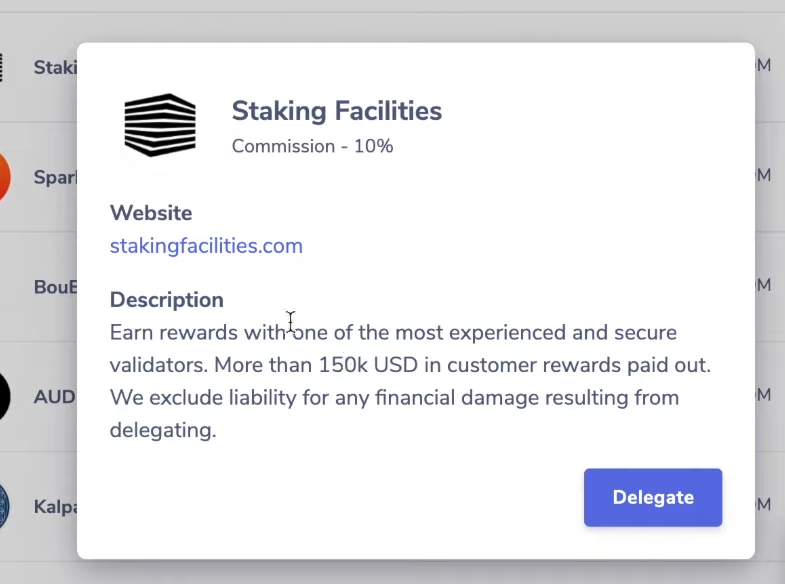
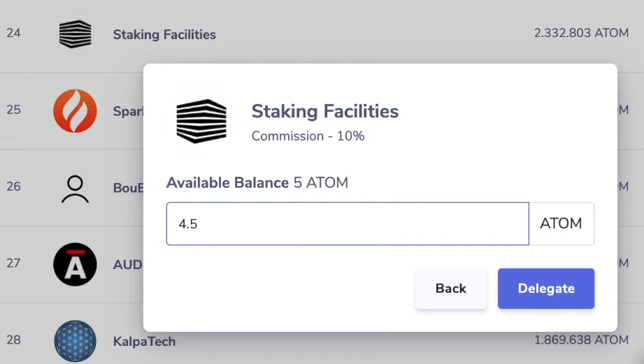
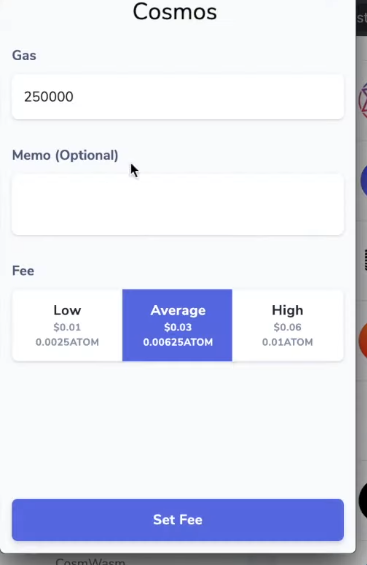
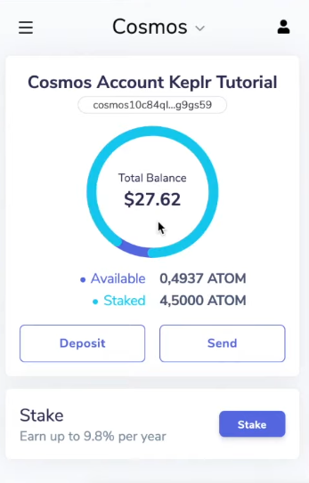
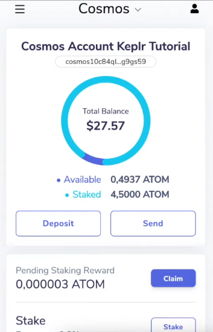

# Staking
The Archway network is a Proof-Of-Stake (PoS) blockchain, meaning that the weight of validators is determined by the amount of staking tokens (ARCHs) bonded as collateral. These ARCHs can be self-delegated directly by the validator or delegated to them by other ARCH holders.

Any user in the system can declare their intention to become a validator by sending a `create-validator` transaction. From there, they become validator candidates.

The weight (i.e. voting power) of a validator determines whether or not they are an active validator

Delegators are ARCH holders who cannot, or do not want to run a validator themselves. ARCH holders can delegate ARCHs to a validator and obtain a part of their revenue in exchange.

Now let's see how we can delegate some tokens to a validator.

You can stake by:
- [Runing a validator](./validator/running-a-validator-node.md)
- [Delegating](./staking.md#Delegate)

## Delegate
You can stake by delegating your tokens to validators who process transactions and run the network.

This allows ARCH holders that don't have the skills or desire to run a validator to participate in securing the network and be rewarded.

### CLI

#### Requirements
- [Installation](./wallet.md#CLI)
- [Create an account](./wallet.md#CLI)

#### Connecting to the network
In order to delegate your stake you have to either [run your node](./node/join-a-network.md) or you can connect to a trustworthy operator.

Malicious operator could return incorrect query results or censor your transactions. However, they will never be able to steal your funds, as your private keys are stored locally on your computer or ledger device. Possible options of full-node operators include validators, wallet providers or exchanges.

<!-- in order to connect to the network we must 

##### Config CLI
We must set the default value for the node we are connecting to
```
archwayd config node <host>:<port>
```
then let us set the default value for `trust-node`flag: 

```
archwayd config trust-node false

// Set to true if you run a light-client node, false otherwise
```

Finally let's set up the chain ID of the network we want to interact with

```
archwayd config chain-id constantinople
``` -->

#### Send funds
In order to delegate we need to send a delegate transaction to a validator

```
archwayd tx staking delegate <validatorOperatorAddress> <amountToBond> --from <yourKeyName> --gas auto --gas-adjustment 1.5 --gas-prices <gasPrice>
```

#### Find Validator's Operator Address

We can query all the validators and pick the one we want to delegate tokens to it.

```bash
archwayd query staking validators
```
```yml
pagination: {}
validators:
- commission:
    commission_rates:
      max_change_rate: "0.100000000000000000"
      max_rate: "0.100000000000000000"
      rate: "0.010000000000000000"
    update_time: "2021-10-12T20:15:35.967858491Z"
  consensus_pubkey:
    '@type': /cosmos.crypto.ed25519.PubKey
    key: X1LGMAY8dToCgBuMIMpctn20Fwenim2YTGoY9Y2J+To=
  delegator_shares: "1000000000.000000000000000000"
  description:
    moniker: my-validator
  min_self_delegation: "1"
  operator_address: archwayvaloper14gxqxpxulxssv7pr4kltr9tl5dujtestxvjhkp
  status: BOND_STATUS_BONDED
  tokens: "1000000000"
  unbonding_time: "1970-01-01T00:00:00Z"
```

As we can see in our example we have one validator and its operator address is `archwayvaloper14gxqxpxulxssv7pr4kltr9tl5dujtestxvjhkp`.

### Keplr


#### Staking

First open your `keplr` browser extension and click on the `Stake` button.

**Note:** Make sure to deposit some tokens beforehand.


Once you click on the `Stake` button, the `keplr` extension opens the `keplr web wallet`. 
Here you can see a list of validators, choose the one you want and click on `Manege >`.

**Warning:** Please do a proper research about the validator before staking any tokens to them.


Let's pick one.


A window opens showing the website of the validator with some extra information.
Click on the `Delegate` button.



Write the amount of tokens that you want to stake.

**Note:** Since there is a transaction fee, make sure not to delegate all your tokens.



Once we click on the `Delegate` button, we see the following window. 
Here we can select the transaction fees, if we want our transaction to be processed faster we can offer a higher fee.


Let's click on the `Set Fee` button.

Now the following page is shown.
Here we need to make sure the validator address is correct before approving it.


We can see the validator address in their website. Now we see the address is correct, so let's approve it.


It takes a few moments for the transaction to get through. After that we can open our `keplr` extension to see the updates on our account.



#### Claiming the Staking Reward

After some time, we can see the staking reward to be claimed.



In order to claim a reward, click on the `Claim` button. 
The following page is shown. 
Again we just select a fee for the transaction and click on the `Set Fee` button.


After few moments, we can see the updates on our account.


**Note:** Since there is a transaction fee, it is recommended to claim the reward once in a while.

#### Un-delegate and Re-delegate

To undelegate our staked tokens, we can click on the validator from the list of validators in our `keplr web wallet` and click on the `Undelegate` button.
**Note:** Please note that in cosmos based networks, we need to wait `21` days for our tokens to be released.


If we want to redelegate our tokens to another validator, we can simply click on the `Redelegate` button from the drop down.


Then select another validator from the list and the rest of the process is just like normal delegation.


_Screenshots from: https://youtu.be/KYntLOLnLdg_
