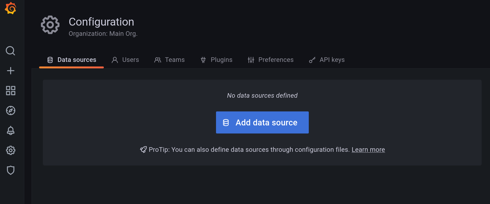

# Monitoring a Validator

There is a [Grafana](https://grafana.com/) dashboard compatible with all the [cosmos-sdk](https://github.com/cosmos/cosmos-sdk) and [tendermint](https://github.com/tendermint/tendermint) based blockchains.

## Preview


Let's set it up for our network.

## Prerequisites

First install [Grafana](https://grafana.com/) and [Prometheus](https://prometheus.io/) on your machine.


## Enable Tendermint Metrics

```bash
sed -i 's/prometheus = false/prometheus = true/g' <YOUR-NODE-HOMEDIR>/config/config.toml
```

After restarting your node, you should be able to access the `tendermint` metrics(default port is 26660): <http://localhost:26660>

## Configure Prometheus Targets

Find `prometheus.yml` file and append the following `job` under the `scrape_configs`:

```yaml
  - job_name: archway
    static_configs:
      - targets: ['localhost:26660']
        labels:
          instance: validator
```

**Note:** On linux machines this file can be found under this path: `/etc/prometheus/prometheus.yml`

## Resolving Port Conflicts

If you run your `archway` network and `Prometheus` on the same machine, you will see one of them cannot run due to a port conflict. Let's resolve it.

**Open the `./node-main/config/app.toml` file and look for**

```toml
[grpc]
address = "0.0.0.0:9090"
``` 

Then change the port to something else like this:

```toml
[grpc]
address = "0.0.0.0:9095"
``` 

## Restart Prometheus

```bash
sudo service prometheus restart
```

Check the status if the prometheus service is running properly:
```bash
systemctl status prometheus.service
```

If you see some output like this, it means it is running without an issue:

```
● prometheus.service - Monitoring system and time series database
     Loaded: loaded (/lib/systemd/system/prometheus.service; enabled; vendor preset: enabled)
     Active: active (running) since Wed 2021-10-06 15:32:48 CEST; 17min ago
       Docs: https://prometheus.io/docs/introduction/overview/
   Main PID: 457917 (prometheus)
      Tasks: 21 (limit: 37746)
     Memory: 48.3M
     CGroup: /system.slice/prometheus.service
             └─457917 /usr/bin/prometheus
```

## Configure Grafana

if you have grafana installed on your machine, you can access it via navigating to this address: <http://localhost:3000>

The default username and password is `admin`.

Click on config, then add a data source.



Then select Prometheus from the list and add its URL.


If you have installed it on your machine, the default URL is: <http://localhost:9090>

Click on `Save & test` to make sure everything is alright.


## Import Grafana Dashboard

Copy and paste the [Grafana Dashboard ID](https://grafana.com/grafana/dashboards/11036) `11036` and click on `Load` to complete importing.


Now you should be able to monitor your validator node.